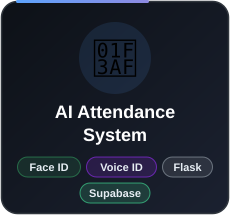
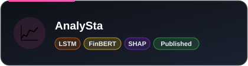
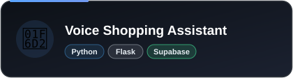
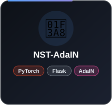
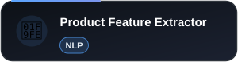
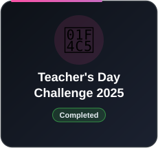
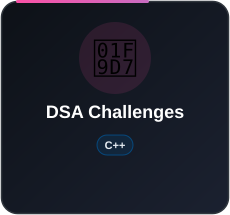
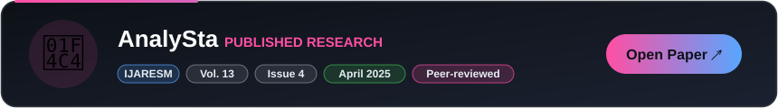

<table width="100%" cellspacing="0" cellpadding="0">
<tr>
<td>

  

<h4 align="center"><i>A Final Year student of CSE (spec. in AIML)</i></h4>

<i>Welcome to my little corner of GitHub! I enjoy building projects that sit at the intersection of <b>Artificial Intelligence and real-world problem solving</b>. Most of my work revolves around turning ideas into practical solutions, sometimes experimental, sometimes things I really love.</i>

  
  

</td>
</tr>
</table>

---

## 👩‍💻 About Me

I'm a final-year **B.Tech CSE (AI/ML)** student who loves *solving complex problems* and *building innovative solutions*.

- 🧠 Building with **Computer Vision, LSTMs, NLP & LLMs**
- ⚙️ Sharpening **DSA with C++** and competitive programming
- 🌐 Shipping AI products end-to-end with **Flask, FastAPI & Streamlit**
- 📄 Published researcher: **IJARESM 2025**

---

## 🌐 Connect With Me

---

## 💻 Tech Stack

**Languages**

**AI / ML & Vision**

**Backend, DB & Tools**

 

---

## 🚀 Featured Projects

 

**🧩 More Builds**

---

## 🏆 Challenges &amp; Consistency

---

## 🧪 Python Mini Projects

 

---

## 📚 Published Research

---

## 📊 GitHub Analytics

 

---

## 📈 Contribution Graph

---

## 🐍 Contribution Snake

<picture>
  <source media="(prefers-color-scheme: dark)" srcset="https://raw.githubusercontent.com/Sanskriti199/Sanskriti199/output/github-snake-dark.svg" />
  <source media="(prefers-color-scheme: light)" srcset="https://raw.githubusercontent.com/Sanskriti199/Sanskriti199/output/github-snake.svg" />
  
</picture>

---

## 🔥 Showing Up Matters

---

⭐ *If you like something here, drop a star!* ⭐

